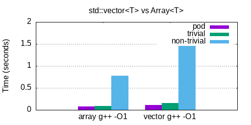
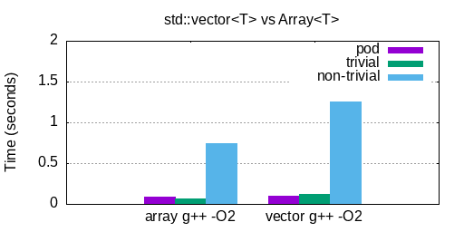
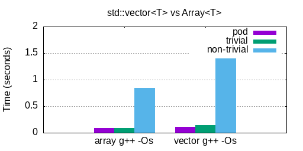
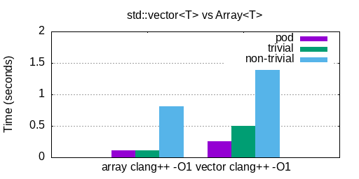
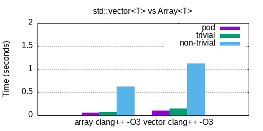

# std::vector<T> replacement benchmark

## Dependencies
You'll need `gnuplot` and `bash` to run `./bench.sh`. In addition to that, you'll
need to have `gcc` and `clang` installed with support for `-std=c++20`.

## Running
To run the benchmark just execute `./bench.sh` this will compile and test `std::vector` against a trivial replacement in `array.cpp` with both `gcc` and `clang` using multiple compilation options (for optimization) and produce bar graph results in the `results/` directory.

## Results
A trivial dynamic array implementation consistently out-performs `std::vector` at all optimization levels for all types (plain old data, trivial, and non-trivial) as can be seen here.

> The difference is approximately 2x better on average.

Not shown here is what happens under no optimizations, i.e -O0 which is common when compiling for debug builds. The reason I chose not to show that is because `std::vector` begins to take ~30 SECONDS in these tests when optimizations are disabled. Also not benched here is MSVC.

### GCC

### CLANG

